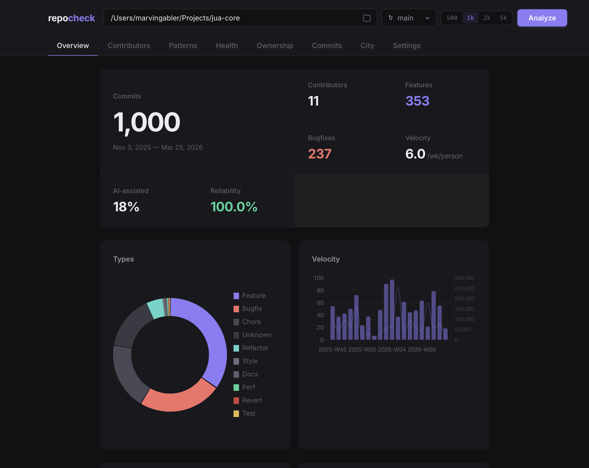
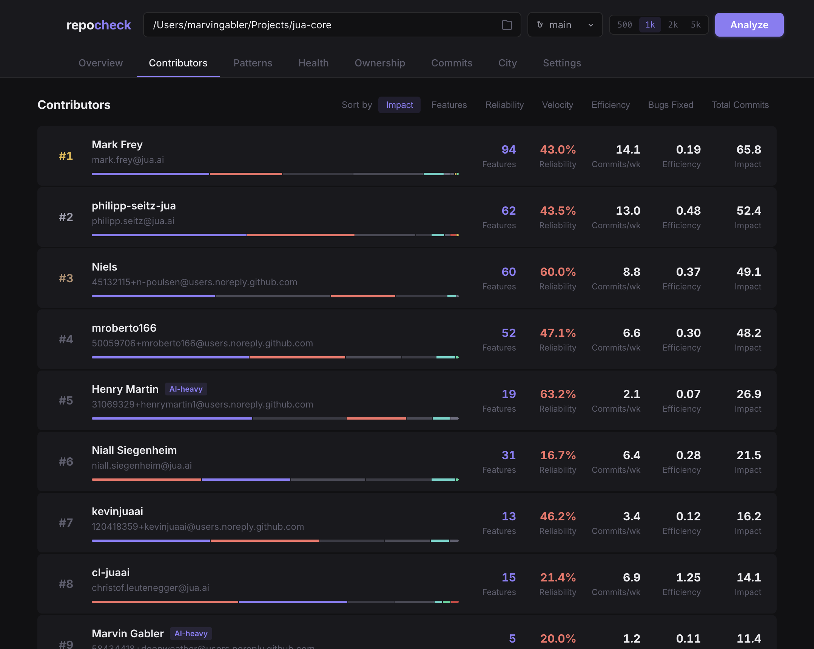
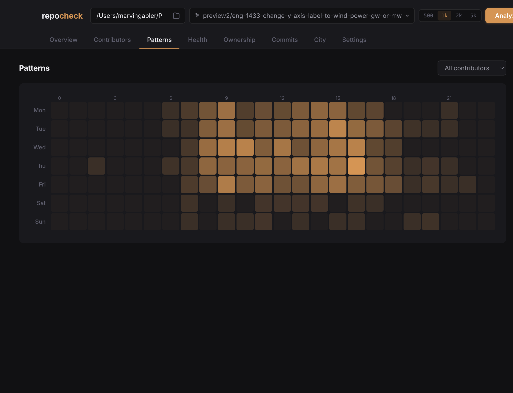

<p align="center">
  <h1 align="center">repocheck</h1>
  <p align="center">Git analytics for engineering teams. Classify commits, track developer output, spot risks.</p>
</p>

<p align="center">
  <a href="https://github.com/deepweather/repocheck/releases/latest"></a>
  <a href="https://github.com/deepweather/repocheck/blob/main/LICENSE"></a>
  <a href="https://github.com/deepweather/repocheck"></a>
</p>

<p align="center">
  <a href="https://github.com/deepweather/repocheck/releases/latest"><strong>Download for macOS</strong></a> · <a href="#run-from-source">Run from source</a> · <a href="#features">Features</a>
</p>

<br>

<p align="center">
  
</p>

---

Point repocheck at any local git repo. It uses OpenAI or Anthropic to classify every commit (feature, bugfix, refactor, chore, ...), then computes per-developer impact, reliability, velocity, and efficiency.

## Download

| Platform | Install |
|----------|---------|
| **macOS** | [Download .dmg](https://github.com/deepweather/repocheck/releases/latest), drag to Applications, launch |
| **Linux / Windows** | [Run from source](#run-from-source) (Python + Node.js) |

## Features

<table>
<tr>
<td width="50%">

**Developer leaderboard.** Ranked by impact score. Shows reliability, velocity, efficiency. Expand a card to see that person's full commit history.

</td>
<td width="50%">



</td>
</tr>
<tr>
<td width="50%">



</td>
<td width="50%">

**Commit heatmap.** Activity by weekday and hour. Click a cell to see the commits, authors, and types for that time slot.

</td>
</tr>
</table>

- **Commit classification** using OpenAI or Anthropic (feature, bugfix, refactor, chore, docs, test, ...)
- **Code ownership** with bus factor, bug hotspot files, knowledge map per directory
- **Health trends** showing bug ratio, complexity, and attrition signals week over week
- **Contributor comparison** via radar chart overlay
- **3D code city** (Three.js) where each file is a block, height based on commits/lines/recency/bugs
- **Diff viewer** for any commit, with real line numbers
- **Cmd+K** to search tabs, contributors, commits
- **Disk cache** keyed by repo + HEAD SHA, instant on repeat visits
- **OpenAI + Anthropic** support, configurable in Settings

## Run from source

```bash
git clone https://github.com/deepweather/repocheck.git
cd repocheck

pip install -r requirements.txt
cd frontend && npm install && npm run build && cd ..

python run.py
```

Opens at [localhost:8484](http://localhost:8484). API key is optional (set in Settings tab or `export OPENAI_API_KEY=...`). Without a key, classification falls back to regex heuristics.

## How it works

1. **Extract** reads git log (commit metadata + file stats, no diffs)
2. **Classify** sends batches to OpenAI/Anthropic in parallel for commit type classification
3. **Compute** calculates impact, reliability, velocity, efficiency, ownership, temporal patterns
4. **Serve** React + TypeScript frontend with Chart.js and Three.js

## Metrics

| Metric | Description |
|--------|-------------|
| Impact | features x3 + bugs x1 + refactors x0.5, penalized by unreliability |
| Reliability | 1 - (features that needed a bugfix within 14 days / total features) |
| Efficiency | features / lines changed x 1000 |
| Velocity | commits per active week |
| Bus factor | % of files with only one contributor |
| Bug latency | median hours from feature to first bugfix on the same files |

## Build the desktop app

```bash
pip install pyinstaller
npm install
./scripts/build-desktop.sh
```

Output: `dist/repocheck-0.1.0.dmg` (~105MB).

## Development

```bash
python run.py --no-browser --port 8484   # backend
cd frontend && npm run dev               # frontend with hot reload

python -m pytest tests/ -v               # 52 tests
ruff check repocheck/                    # lint
```

## License

MIT
